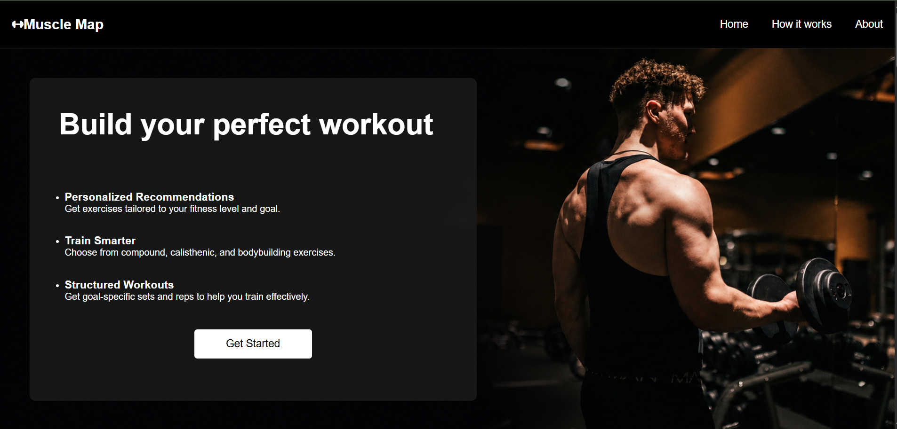
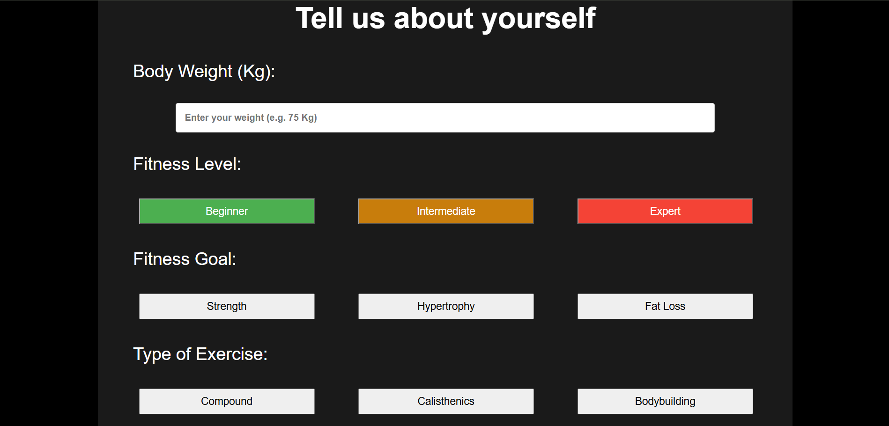
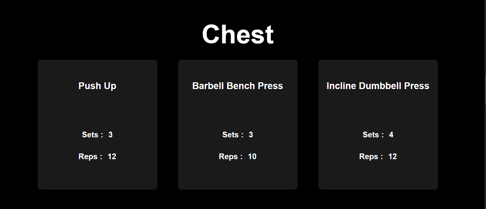

# Muscle Map

Muscle Map is my first complete web development project, built using HTML, CSS, and Vanilla JavaScript.

The idea behind the project is to generate a personalized workout based on a user's body weight, fitness level, fitness goal, and preferred type of exercise.

This project was mainly built as a way for me to put the fundamentals I learned in HTML, CSS, and JavaScript into practice and turn them into an actual interactive application.

## Preview

### Landing Page



### User Input



### Generated Workout



## Features

* Personalized workout generation
* Fitness level selection:

  * Beginner
  * Intermediate
  * Expert
* Fitness goal selection:

  * Strength
  * Hypertrophy
  * Fat Loss
* Exercise type selection:

  * Compound
  * Calisthenics
  * Bodybuilding
* Dynamic exercise filtering
* Goal-specific sets and repetitions
* Workout generation for different muscle groups
* Input validation
* Loading animation while generating the workout
* Smooth scrolling between sections
* Interactive buttons and UI states
* Dynamic DOM updates

## Technologies Used

### HTML5

Used to structure the application into:

* Navigation
* Hero section
* User input section
* Workout results
* Exercise cards

### CSS3

Used for the overall visual design and user interaction, including:

* Flexbox
* Responsive layout foundations
* Transitions
* Hover effects
* Transformations
* Custom buttons
* Card-based layouts
* Background images
* CSS animations
* Loading spinner

### JavaScript

JavaScript is responsible for the main functionality of the application.

Some of the concepts I practiced while building this project include:

* Variables and constants
* Arrays and objects
* Classes and constructors
* Functions
* Loops
* Conditional statements
* Event listeners
* DOM manipulation
* Array filtering
* Dynamic content generation
* Object property access
* Managing UI states
* User input validation
* Asynchronous JavaScript

## How It Works

The user first enters their body weight and selects:

1. Fitness level
2. Fitness goal
3. Exercise type

When the user clicks **Generate Workout**, JavaScript processes these selections and filters the available exercise data according to the selected criteria.

The application then generates exercises for different muscle groups and dynamically updates the workout cards with:

* Exercise name
* Number of sets
* Number of repetitions

A loading state is also displayed during the workout-generation process to make the interaction feel more natural.

## Project Structure

```text
Muscle-Map/
│
├── index.html
├── style.css
├── script.js
├── exercises.js
│
├── assets/
│   ├── landing-page.png
│   ├── input-section.png
│   └── workout-results.png
│
└── README.md
```

## What I Learned

This project was a major step in my transition from learning programming concepts to actually building something with them.

I spent around one and a half months learning the fundamentals of HTML, CSS, and JavaScript before and during the development of this project. What I initially expected to take only a few days ended up taking considerably longer.

A large part of the time was spent understanding how different parts of the application should work together rather than simply writing the code.

Some of the things I learned through this project include:

* How to structure a complete webpage
* How CSS can be used to create interactive interfaces
* How JavaScript interacts with HTML through the DOM
* How to organize exercise data using objects and arrays
* How to filter data according to multiple conditions
* How to dynamically update elements on a webpage
* How to manage different UI states
* How to use asynchronous behavior to create a loading experience
* How to debug problems when different parts of the application interact

## Current Version

This is **Version 1** of Muscle Map.

The purpose of this version was primarily to build the core functionality and strengthen my understanding of Vanilla JavaScript.

I am intentionally keeping some improvements for Version 2 rather than adding everything to the first version.

## Future Improvements

Some improvements I plan to work on in Version 2 include:

* Better mobile responsiveness
* Workout regeneration
* Reset functionality
* More meaningful use of body weight
* Improved exercise cards
* Exercise descriptions and additional information
* Improved overall UI/UX
* Additional workout customization

## Conclusion

Muscle Map started as a way to practice HTML, CSS, and JavaScript, but it became a much larger learning experience than I initially expected.

It is still a relatively simple project, but building it from scratch gave me practical experience with concepts that are difficult to fully understand through tutorials alone.

This is only the first version, and I plan to continue improving it as I learn more.

## Author

**Muhammad Ashhal**

Software Engineering Student
LinkedIn: [Your LinkedIn Profile]
